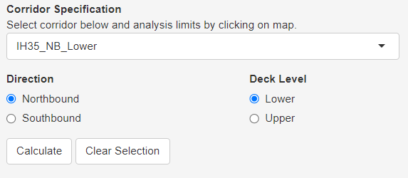
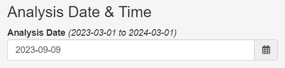
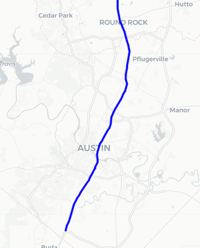
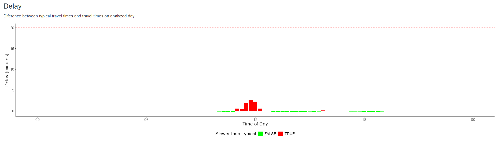
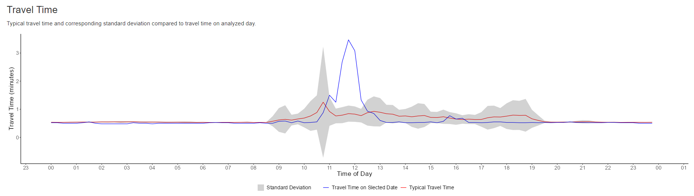
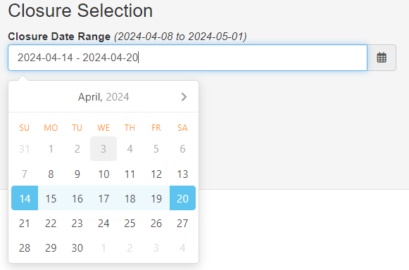
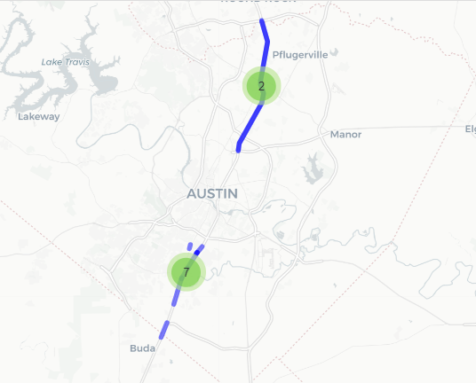
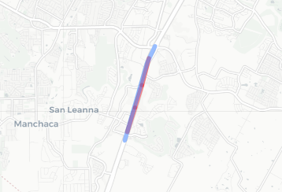

# Work Zone API Calls
This guide will walk the user through the API calls used to make the Work Zone App properly calculate travel times.

## Four Areas of Focus (Sub-routes)
Each area of focus has various calls associated with them to help the user get the expected output.
* [Corridors](#corridors-2-calls)
  - [Get Corridors](#1-get-corridors-found-in-corridorspy)
  - [Get Corridor Date Range](#2-get-corridor-date-range-found-in-corridorspy)
* [Segments](#segments-1-call)
  - [Get Segments](#1-get-segments-found-in-segmentspy)
* [Timing](#timing-3-calls)
  - [Get Travel Times](#1-get-travel-times-found-in-timingpy)
  - [Calculate Travel Time Indices](#2-calculate-travel-time-index-found-in-timingpy)
  - [Calculate Free Flow Travel Time](#3-calculate-free-flow-travel-time-found-in-timingpy)
* [Workzone](#workzone-5-calls)
  - [Get Work Zone Date Range](#1-get-work-zone-date-range-found-in-workzonepy)
  - [Get Active Work Zones](#2-get-active-work-zones-found-in-workzonepy)
  - [Get The Updated Work Zones](#3-get-the-updated-work-zones-found-in-workzonepy)
  - [Get Work Zone to INRIX Segments Mapping](#4-get-work-zone-to-inrix-segments-mapping-found-in-workzonepy)
  - [Get Work Zome to INRIX Corridor Mapping](#5-get-work-zone-to-inrix-corridor-mapping-found-in-workzonepy)

## [Corridors](https://github.com/TACC/ridi-api/blob/jan_dev/project/app/routers/corridors/corridors.py) (2 calls)
This set is intended to list the corridors (using stored procedure **_get_corrs_info0_**) and their respective date ranges (using stored procedure **_get_ixdata_daterange0_**).

### 1.) Get Corridors (found in [corridors.py](https://github.com/TACC/ridi-api/blob/jan_dev/project/app/routers/corridors/corridors.py#L16))
This API call returns a list of corridors (unique to their direction and deck-level) associated with their "study name" (identity name given by TxDOT). Each corridor entry on that list includes its id, name, length (in miles), and direction. **Note**: By default, the API call will assume the user isn't requesting corridor geometry (_geog_flag_) and a map version of 2401 (_map_ver_).
```
/v1/corridors/{study_name}
```
or
```
/v1/corridors/{study_name}?map_ver={map_ver}&geog_flag={true_or_false}
```

#### Example call to request Austin's IH-35 corridors (_"txdot-aus"_):
```
http://129.114.36.28/v1/corridors/txdot-aus
```
or (optionally)
```
http://129.114.38.150/v1/corridors/txdot-aus?map_ver=2401&geog_flag=false
```

#### Example call response of Austin's IH-35 corridors:
```
[
  {
    "id": "8c693a02-18d5-4aee-58ab-d6d681ca57a9",
    "name": "IH35_NB_Lower",
    "length_mi": 42.399757385253906,
    "direction": "NB",
    "geog": null
  },
  {
    "id": "76aaba57-391e-83f7-2964-c80944b8575e",
    "name": "IH35_SB_Lower",
    "length_mi": 41.799163818359375,
    "direction": "SB",
    "geog": null
  },
  {
    "id": "02f89136-24fc-a64c-f162-f65ffd7960e9",
    "name": "IH35_NB_Upper",
    "length_mi": 42.39908218383789,
    "direction": "NB",
    "geog": null
  },
  {
    "id": "7c540d97-1cf5-92e4-de27-a4b698d72084",
    "name": "IH35_SB_Upper",
    "length_mi": 41.800621032714844,
    "direction": "SB",
    "geog": null
  }
]
```

#### '_Work Zone Web App_' use case:
This call runs everytime the user selects a new direction and/or deck-level. Based on this input, it will determine the corridor id and save it for later analysis.



### 2.) Get Corridor Date Range (found in [corridors.py](https://github.com/TACC/ridi-api/blob/jan_dev/project/app/routers/corridors/corridors.py#L38))
This API call returns the date range (two timestamps denoting the earliest and latest dates available) for the corridor id given. **Note**: By default, the API call will assume a request of 15-minute aggregation.
```
/v1/corridors/daterange/{corridor_id}
```
or (optionally)
```
/v1/corridors/daterange/{corridor_id}?agg={time_agg}
```

#### Example call to request date ranges for corridor "_IH35_NB_Upper_" ("_8c693a02-18d5-4aee-58ab-d6d681ca57a9_"):
```
http://129.114.36.28/v1/corridors/daterange/8c693a02-18d5-4aee-58ab-d6d681ca57a9
```
or
```
http://129.114.38.150/v1/corridors/daterange/8c693a02-18d5-4aee-58ab-d6d681ca57a9?agg=15
```

#### Example call response of date ranges for corridor "_IH35_NB_Upper_" ("_8c693a02-18d5-4aee-58ab-d6d681ca57a9_"):
```
{
  "date_early": "2023-03-01",
  "date_late": "2024-03-01"
}
```

#### '_Work Zone Web App_' use case:
This call depends on the selection of a corridor, so it also runs everytime the user selects a new direction or deck-level. Based on the corridor selected, the user will have the ability to select any frame of time within the date range returned by the API.<br/>


## [Segments](https://github.com/TACC/ridi-api/blob/jan_dev/project/app/routers/segments/segments.py) (1 call)
This set, which only contains one call at the moment, is intended to provide INRIX segments and other relevant information (using stored procedure **_get_corr_segs0_**)

### 1.) Get Segments (found in [segments.py](https://github.com/TACC/ridi-api/blob/jan_dev/project/app/routers/segments/segments.py#L16))
This API call returns the list of INRIX segments for the corridor id given. Optionally, the _geog_flag_ can be set to _"true"_ or _"false"_ (false by default) to specify whether the geography is included in the output. Each segment entry on that list includes its corridor id, segment id, segment sequence number, road name, postal code, state of origin, direction, intersection name, length (in miles), and geography (in linestring format). **Note**: By default, the API call will assume the user isn't requesting corridor geometry (_geog_flag_).
```
/v1/segments/{corridor_id}
```
or (optionally)
```
/v1/segments/{corridor_id}?geog_flag={has_geog}
```

#### Example call to request the segments for corridor "_IH35_NB_Upper_" ("_8c693a02-18d5-4aee-58ab-d6d681ca57a9_") with geography:
```
http://129.114.36.28/v1/segments/8c693a02-18d5-4aee-58ab-d6d681ca57a9?geog_flag=true
```

#### Example call response of the segments for corridor "_IH35_NB_Upper_" ("_8c693a02-18d5-4aee-58ab-d6d681ca57a9_") with geography:
```
[
  {
    "corr_id": "8c693a02-18d5-4aee-58ab-d6d681ca57a9",
    "xd_id": 1595238314,
    "seg_seq": 1,
    "road": "35 / I-35 N",
    "postal": 78610,
    "state": "Texas",
    "direction": "N",
    "intersection": "I-35  Exit 225 / I-35",
    "length_mi": 0.6311349868774414,
    "geog": "LINESTRING(-97.805 30.114,-97.802 30.123...)"
  },
  {
    "corr_id": "8c693a02-18d5-4aee-58ab-d6d681ca57a9",
    "xd_id": 1595244009,
    "seg_seq": 2,
    "road": "35 / I-35 N",
    "postal": 78747,
    "state": "Texas",
    "direction": "N",
    "intersection": null,
    "length_mi": 0.5989900231361389,
    "geog": "LINESTRING(-97.802 30.123,-97.799 30.131...)"
  },

  ...

]
```

#### '_Work Zone Web App_' use case:
This call depends on the selection of a corridor, so it also runs everytime the user selects a new direction or deck-level. Based on the corridor selected, it is used to determine what shapefile to display in the map.<br/>


## [Timing](https://github.com/TACC/ridi-api/blob/jan_dev/project/app/routers/timing/timing.py) (3 calls)
This set is intended to provide calculated INRIX information regarding its average travel times (using stored procedure **_get_typical_tt_**), travel time heat map indices (using stored procedure **_get_avg_tti0_**) and free-flow time (using stored procedure **_get_fftt0_**).

### 1.) Get Travel Times (found in [timing.py](https://github.com/TACC/ridi-api/blob/jan_dev/project/app/routers/timing/timing.py#L16))
This API call returns a combination of calculations regarding the average (typical) and standard deviation of the travel times in order to compare it with the current (analysis) travel time for each 15-minute interval on a specified day of week. Each travel time entry includes a timestamp, hour, minute, day of week, standard deviation, typical travel time, number of observations, whether it's a weekend, and analysis travel time. **Note**: By default, the API call will assume a request of 15-minute aggregation and unrestricted sequence of segment (all segments on that corridor).
```
/v1/timing/traveltime/corridor/{corridor_id}/start/{start_date}/end/{end_date}/refstart/{ref_start_date}/refend/{ref_end_date}
```
or
```
/v1/timing/traveltime/corridor/{corridor_id}/start/{start_date}/end/{end_date}/refstart/{ref_start_date}/refend/{ref_end_date}?agg={agg}&start_seq={start_seq}&end_seq={end_seq}
```

#### Example call to request the travel times for corridor "_IH35_NB_Upper_" ("_8c693a02-18d5-4aee-58ab-d6d681ca57a9_") over a specified reference date range and analysis date:
```
http://129.114.38.150/v1/timing/traveltime/corridor/8c693a02-18d5-4aee-58ab-d6d681ca57a9/start/2023-09-09/end/2023-09-10/refstart/2023-03-01/refend/2023-09-01?agg=15&start_seq=1&end_seq=1
```
or
```
http://129.114.38.150/v1/timing/traveltime/corridor/8c693a02-18d5-4aee-58ab-d6d681ca57a9/start/2023-09-09/end/2023-09-10/refstart/2023-03-01/refend/2023-09-01?start_seq=1&end_seq=1
```

#### Example call response of the travel times for corridor "_IH35_NB_Upper_" ("_8c693a02-18d5-4aee-58ab-d6d681ca57a9_") over a specified reference date range and analysis date:
```
[
  {
    "timestamp": "2023-09-09T00:00:00",
    "hour": 0,
    "minute": 0,
    "dow": 6,
    "std_dev": 0.015988171100616455,
    "typical_tt": 0.5353845953941345,
    "observations": 26,
    "is_weekend": true,
    "analysis_tt": 0.5199999809265137
  },
  {
    "timestamp": "2023-09-09T00:15:00",
    "hour": 0,
    "minute": 15,
    "dow": 6,
    "std_dev": 0.014293012209236622,
    "typical_tt": 0.5326923131942749,
    "observations": 26,
    "is_weekend": true,
    "analysis_tt": 0.5199999809265137
  },

  ...

]
```

#### '_Work Zone Web App_' use case:
This call depends on the "Calculate" button. Once it's clicked, the analysis information will be used to call the API call. Based on the corridor and analysis/reference dates, it is used to determine generate 2 plots (a side-by-side comparison and a delay visualization).<br/>



### 2.) Calculate Travel Time Index (found in [timing.py](https://github.com/TACC/ridi-api/blob/jan_dev/project/app/routers/timing/timing.py#L103))
This API call returns a list of travel time indices that will denote the magnitude of travel time in comparison to the typical travel time for each 15-minute interval at the specified segment sequence. Each travel time index entry includes a segment id, timestamp, day of week, and travel time magnitude value. **Note**: By default, the API call will assume a request of 15-minute aggregation.
```
/v1/timing/traveltimeindex/segments/{segment_ids}/start/{start_date}/end/{end_date}
```
or
```
/v1/timing/traveltimeindex/segments/{segment_ids}/start/{start_date}/end/{end_date}?agg={time_agg}
```

#### Example call to request the travel time heatmap indices for segment ids 1595265202, 1595238385, 1595238369 & 1595401911 over a specified date range and 15-minute aggregation:
```
http://129.114.38.150/v1/timing/traveltimeindex/segments/1595265202%2C%201595238385%2C%201595238369%2C%201595401911/start/2023-03-01/end/2024-02-29?agg=15
```

#### Example call response of the travel time heatmap indices for corridor "_IH35_NB_Upper_" ("_8c693a02-18d5-4aee-58ab-d6d681ca57a9_") over a specified date range:
```
[
  {
    "seg_id": 1595238369,
    "timestamp": "00:00:00",
    "dow": "Friday",
    "avg_tti": 0.5217391304347826
  },
  {
    "seg_id": 1595238369,
    "timestamp": "00:00:00",
    "dow": "Monday",
    "avg_tti": 0.6666666666666666
  },

  ...

]
```

### 3.) Calculate Free Flow Travel Time (found in [timing.py](https://github.com/TACC/ridi-api/blob/jan_dev/project/app/routers/timing/timing.py#L133))
This API call returns the calculated travel time of the corridor at the specified start/end sequence of segments. The time value will be denoted in minutes. **Note**: By default, the API call will assume an unrestricted sequence of segments (all segments on that corridor).

```
/v1/timing/freeflowtraveltime/corridor/{corridor_id}/start/{start_date}/end/{end_time}/percentile/{decimal_percentage}
```
or
```
/v1/timing/freeflowtraveltime/corridor/{corridor_id}/start/{start_date}/end/{end_time}/percentile/{decimal_percentage}?start_seq={start_seq}&end_seq={end_seq}
```

#### Example call to request the free flow travel time for a selected sequence of segments on corridor "_IH35_NB_Upper_" (_'76aaba57-391e-83f7-2964-c80944b8575e'_) over a specified date range:
```
http://129.114.38.150/v1/timing/freeflowtraveltime/corridor/76aaba57-391e-83f7-2964-c80944b8575e/start/2023-03-01/end/2024-03-01/percentile/1?start_seq=1&end_seq=1
```

#### Example call response of the free flow travel time for a selected sequence of segments on corridor "_IH35_NB_Upper_" ("_76aaba57-391e-83f7-2964-c80944b8575e_") over a specified date range:
```
{
  "percentile_time": 16.6299991607666
}
```

#### No use cases:
There are no use cases, i.e. there are no applications using this API call for anything.

## [Workzone](https://github.com/TACC/ridi-api/blob/jan_dev/project/app/routers/workzone/workzone.py) (5 calls)
This set is intended to get the date range of all work zones (using stored procedure **_get_wzdx_txdot_flat_dr0_**), list active work zones (using stored procedure **_get_wzdx_txdot_flat_adates1_**), and provide a mapping mechanism of workzones to INRIX segments (using stored procedure **_get_wzdx_map0_**).

### 1.) Get Work Zone Date Range (found in [workzone.py](https://github.com/TACC/ridi-api/blob/jan_dev/project/app/routers/workzone/workzone.py#L17))
This API call returns the date range (two timestamps denoting the earliest and latest dates available) for all the available work zones. **Note**: The API call has no parameters at all.
```
/v1/workzone/daterange
```

#### Example call to request work zone date range:
```
http://129.114.38.150/v1/workzone/daterange
```

#### Example call response of work zones date range:
```
{
  "date_early": "2024-04-08",
  "date_late": "2024-05-01"
}
```

#### '_Work Zone Web App_' use case:
This call does not depend on any arguments. It returns workzone closures everytime the application reloads. The date range is used to set the maximum and minimum dates available for the user to select.<br/>


### 2.) Get Active Work Zones (found in [workzone.py](https://github.com/TACC/ridi-api/blob/jan_dev/project/app/routers/workzone/workzone.py#L118))
This API call returns a list of active work zones based on their active range date and direction. Each work zone entry on that list includes its id, core details, start date, end date, verification information, closure characteristics, geographical information, and geography (in linestring format)
```
/v1/workzone/inrix_closures/activedate/start/{start_date}/end/{end_date}/direction/{direction}/corridor/{corridor_id}
```

#### Example call to request all active work zones in the given date range:
```
http://129.114.38.150/v1/workzone/inrix_closures/activedate/start/2024-04-14/end/2024-04-20/direction/northbound/corridor/283fb7b6-abcc-5b1a-9a8a-d91d3d47ab9d
```

#### Example call response of all active work zones in the given date range:
```
[
  {
    "id": "ffd6ca0b-ad01-50f2-b949-e8817af67f34",
    "orig_id": "ffd6ca0b-ad01-50f2-b949-e8817af67f34",
    "core_details_event_type": "work-zone",
    "core_details_data_source_id": "df8119c5-356f-dfa1-1c58-30647d4cdf92",
    "core_details_road_names": "{IH0035}",
    "core_details_name": "IH35",
    "core_details_description": "- Motorists should expect delays.<br/>- Multiple left lanes closed.<br/>- Use alternate route<br/><br/><br/>NBML double left lane closure. Single set at 9pm, transition to double at 11pm",
    "core_details_creation_date": "2024-04-12T22:57:27Z",
    "core_details_update_date": "2024-04-12T22:57:27Z",
    "core_details_direction": "northbound",
    "start_date": "2024-04-15",
    "end_date": "2024-04-19",
    "is_start_date_verified": false,
    "is_end_date_verified": false,
    "is_start_position_verified": false,
    "is_end_position_verified": false,
    "location_method": "junction-method",
    "vehicle_impact": "all-lanes-closed",
    "beginning_cross_street": "SL0275",
    "ending_cross_street": "US0290",
    "bbox": "{-97.778,30.179,-97.763,30.198}",
    "geog": "LINESTRING(-97.778 30.179,-97.774 30.184...",
    "lon": -97.77165985107422,
    "lat": 30.188987731933594,
    "start_lon": -97.77812194824219,
    "start_lat": 30.17920684814453,
    "end_lon": -97.76390838623047,
    "end_lat": 30.198694229125977
  },

  ...

]
```

#### '_Work Zone Web App_' use case:
This function depends on the "Get Closures" button. Once it's clicked, the date range will be used to gather the active work zones via the API call. As a result, all the collected work zones will be drawn on the map.<br/>


### 3.) Get The Updated Work Zones (found in [workzone.py](https://github.com/TACC/ridi-api/blob/jan_dev/project/app/routers/workzone/workzone.py#L23))
This API call returns a list of active work zones based on their update range date and direction. Each work zone entry on that list includes its id, core details, start date, end date, verification information, closure characteristics, geographical information, and geography (in linestring format)
```
/v1/workzone/closures/updatedate/start/{start_date}/end/{end_date}/direction/{direction}
```

#### Example call to request all active work zones by update date in the given date range:
```
http://129.114.38.150/v1/workzone/closures/updatedate/start/2024-04-14/end/2024-04-20/direction/northbound
```

#### Example call response of all active work zones by update date in the given date range:
```
[
  {
    "id": "ffd6ca0b-ad01-50f2-b949-e8817af67f34",
    "orig_id": "ffd6ca0b-ad01-50f2-b949-e8817af67f34",
    "core_details_event_type": "work-zone",
    "core_details_data_source_id": "df8119c5-356f-dfa1-1c58-30647d4cdf92",
    "core_details_road_names": "{IH0035}",
    "core_details_name": "IH35",
    "core_details_description": "- Motorists should expect delays.<br/>- Multiple left lanes closed.<br/>- Use alternate route<br/><br/><br/>NBML double left lane closure. Single set at 9pm, transition to double at 11pm",
    "core_details_creation_date": "2024-04-12T22:57:27Z",
    "core_details_update_date": "2024-04-12T22:57:27Z",
    "core_details_direction": "northbound",
    "start_date": "2024-04-15",
    "end_date": "2024-04-19",
    "is_start_date_verified": false,
    "is_end_date_verified": false,
    "is_start_position_verified": false,
    "is_end_position_verified": false,
    "location_method": "junction-method",
    "vehicle_impact": "all-lanes-closed",
    "beginning_cross_street": "SL0275",
    "ending_cross_street": "US0290",
    "bbox": "{-97.778,30.179,-97.763,30.198}",
    "geog": "LINESTRING(-97.778 30.179,-97.774 30.184...",
    "lon": -97.77165985107422,
    "lat": 30.188987731933594,
    "start_lon": -97.77812194824219,
    "start_lat": 30.17920684814453,
    "end_lon": -97.76390838623047,
    "end_lat": 30.198694229125977
  },

  ...

]
```

#### No use cases:
There are no use cases, i.e. there are no applications using this API call for anything.

### 4.) Get Work Zone to INRIX Segments Mapping (found in [workzone.py](https://github.com/TACC/ridi-api/blob/jan_dev/project/app/routers/workzone/workzone.py#L171))
This API call returns a mapping of INRIX segments based on the direction of the workzone. Each INRIX mapping entry on that list includes its segment sequence and id, direction, geographical information, regional details/characteristics, length, and geography (in linestring format).
```
/v1/workzone/closures/inrixmap/direction/{workzone_dir}
```

#### Example call to request the INRIX mapping of the specified work zone direction:
```
http://129.114.38.150/v1/workzone/closures/activedate/start/2024-04-14/end/2024-04-20/direction/N
```

#### Example call response of the INRIX mapping of the specified work zone direction:
```
[
  {
    "seg_seq": 39,
    "segment_id": 1595400733,
    "road": "35 / I-35 N",
    "direction": "N",
    "start_latitude": 30.379159927368164,
    "end_latitude": 30.392410278320312,
    "start_longitude": -97.67481994628906,
    "end_longitude": -97.67151641845703,
    "region": "Texas",
    "district": "Travis",
    "postal_code": 78753,
    "segment_length": 0.9372519850730896,
    "intersection": "I-35  Exit 244 / I-35",
    "geog": "LINESTRING(-97.674 30.379,-97.671 30.392...)"
  },

  ...

]
```

#### '_Work Zone Web App_' use case:
This call depends on the click of the map. Once a work zone is clicked (selected), the direction will be used to get the INRIX mapping and draw the segments that closely resemble the work zone.<br/>


### 5.) Get Work Zone to INRIX Corridor Mapping (found in [workzone.py](https://github.com/TACC/ridi-api/blob/jan_dev/project/app/routers/workzone/workzone.py#L199))
This API call returns a list of INRIX corridors in a study that are within the location of the workzone. Each INRIX corridor entry on that list includes its corridor id, segment sequences, total corridor distance, total workzone distance, and whether its direction is reversed.
```
/v1/workzone/inrix/corridors/id/{workzone_id}/study/{study_name}
```

#### Example call to request the INRIX corridors of the specified work zone based on the study:
```
http://129.114.38.150/v1/workzone/inrix/corridors/id/3fa85f64-5717-4562-b3fc-2c963f66afa6/study/txdot-aus
```

#### Example call response of the INRIX corridors of the specified work zone based on the study:
```
[
  {
    "corr_id": "3fa85f64-5717-4562-b3fc-2c963f66afa6",
    "start_seg_seq": 1,
    "end_seg_seq": 31,
    "start_corr_mi": 1.23,
    "end_corr_mi": 0.964,
    "start_wz_mi": 1.22,
    "end_wz_mi": 1.01,
    "reversed": false
  },

  ...

]
```

#### No use cases:
There are no use cases, i.e. there are no applications using this API call for anything.
